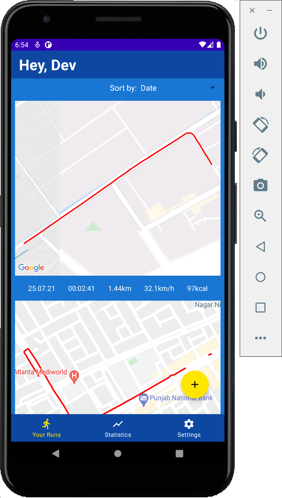
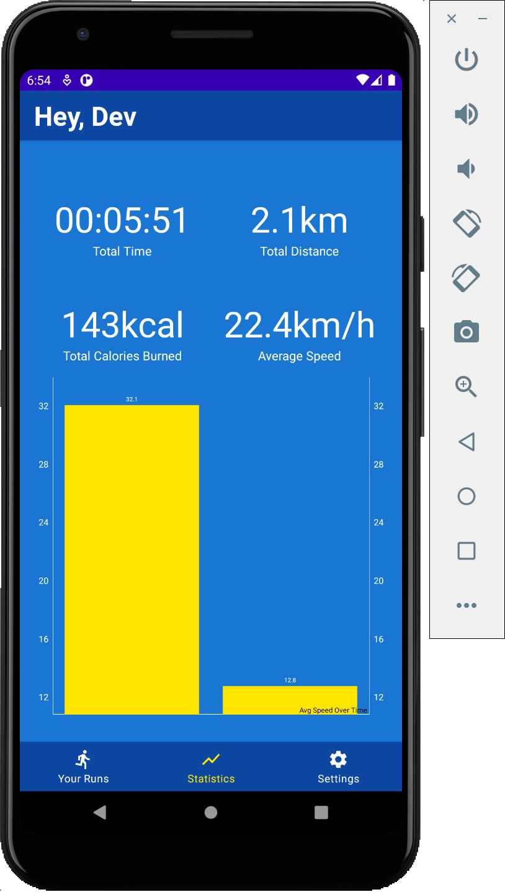
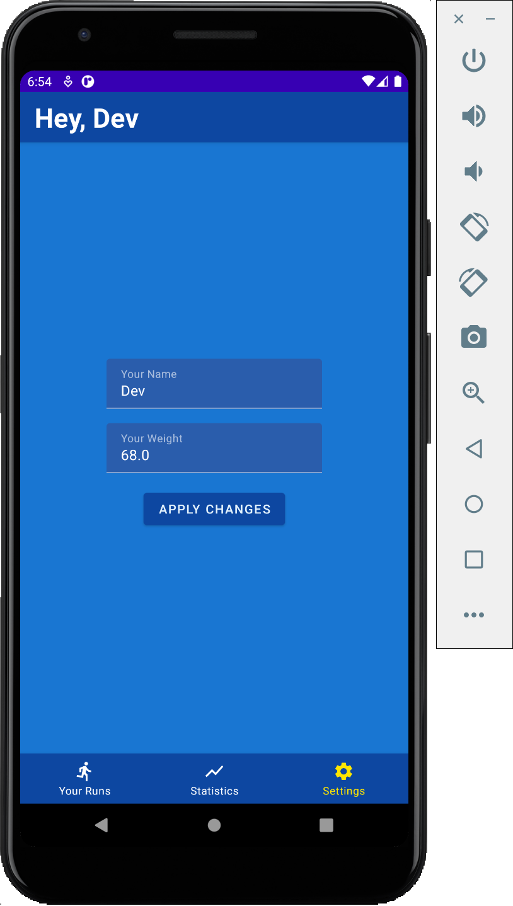
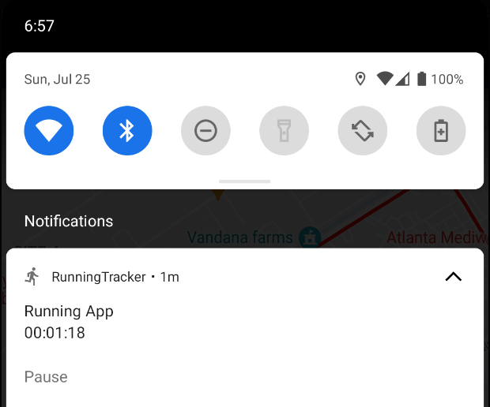
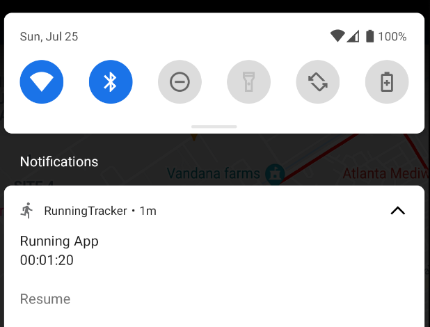
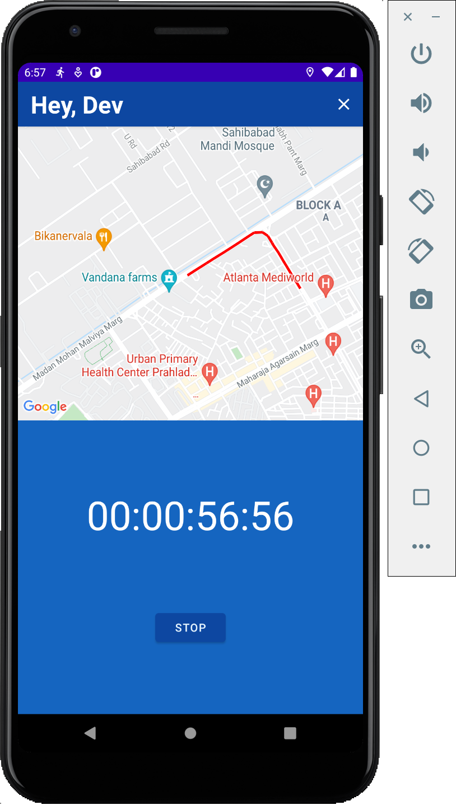
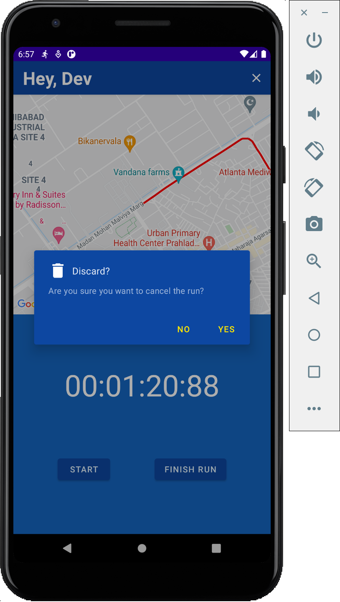

# Running Tracker

A running tracker android app that uses Google Maps SDK to locate and track morning jogs/runs, calculates distance travelled and calories burned.

  

## Features

- MVVM Architecture.
- Uses Google MAPs SDK.
- RoomDB (SQLite).
- Keeps tracking the location even in the background.
- Pause / Resume tracking from the notification.
- Shows total calories burned.
- Dependency injection using Dagger Hilt.
- Kotlin Coroutines.

## Priviews

### Notification Service
      

### Run Tracking
 
